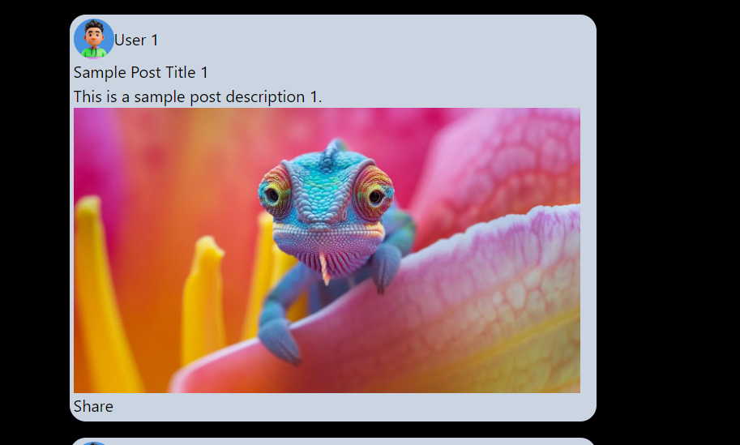
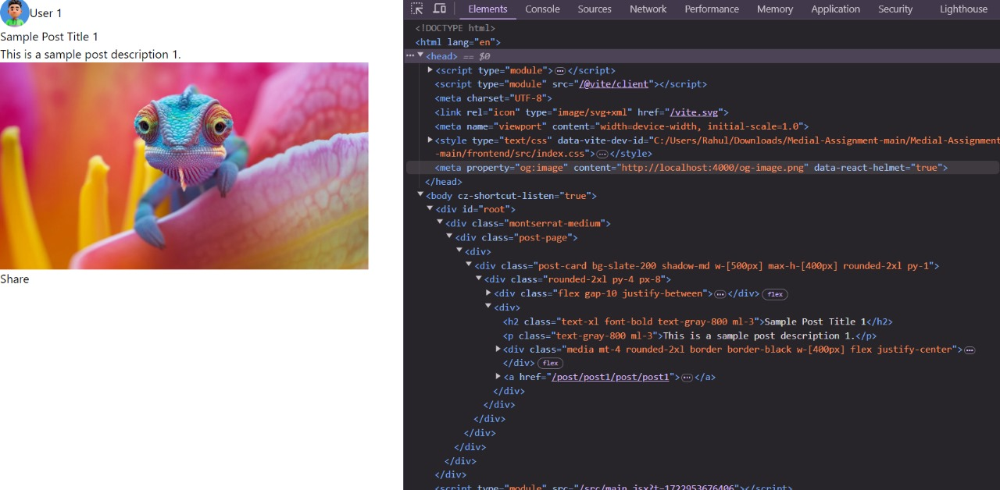
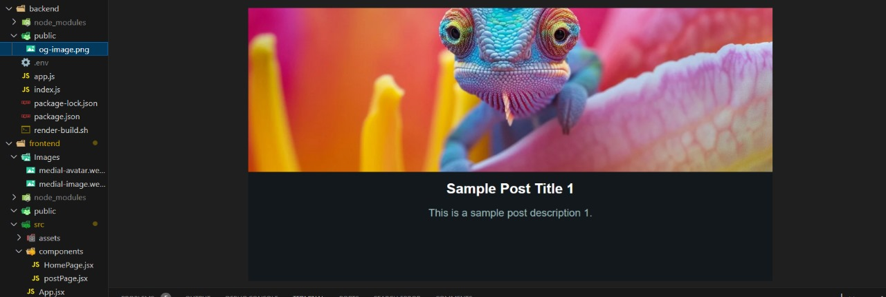

# Dynamic Post Page with OG Image Generation

## Objective

This project aims to create a static post page using React that dynamically generates an Open Graph (og:image) based on the post content.

## Requirements

1.  *Post Page*:
    
    -   Develop a simple post page using React.
    -   Include fields for title, content, and optionally an image, using any social media post design.
2.  *OG Image Generation*:
    
    -   Create a system to dynamically generate an og:image (1200x630 pixels) using the post content.
    -   The og:image should include the post title, a snippet of the content, and any associated image. It should replicate the design of the post itself.
3.  *Integration*:
    
    -   Automatically add the og:image meta tag to the post page's HTML.
    -   Ensure the generated image URL is accessible.
4.  *Styling*:
    
    -   Style the og:image to be visually appealing and readable.
    -   Include branding elements (e.g., logo or color scheme).
5.  *Performance*:
    
    -   Optimize the image generation process for speed.

## Project Flow

### 1. *Frontend (React)*

#### Structure

-   App.jsx: Sets up routing for the homepage and individual post pages.
-   HomePage.jsx: Displays a list of posts using PostCard components.
-   PostPage.jsx: Displays the full post and includes the Open Graph image meta tag.
-   PostCard.jsx: Represents individual post cards with title, description, and media.
-   PostData.jsx: Provides mock data for posts.

#### Components

-   App.jsx: Manages routing using react-router-dom.
-   HomePage.jsx: Fetches and displays posts.
-   PostCard.jsx: Displays a summary of the post with options to like, comment, and share.
-   PostPage.jsx: Fetches a single post's details and dynamically generates the Open Graph image URL.

### 2. *Backend (Node.js with Express)*

#### Structure

-   index.js: Main entry point for the backend.
-   Uses Puppeteer to generate screenshots of HTML content for the Open Graph image.

#### API Endpoints

-   /api/generate-html: Generates HTML content for the post.
-   /api/generate-image: Uses Puppeteer to create an Open Graph image from the HTML content.

## Installation and Setup

### Prerequisites

-   Node.js (v14 or higher)
-   npm (v6 or higher)

### Steps

1.  *Clone the repository*
    
    sh
    
    Copy code
    
    `git clone <https://github.com/wraith2009/Medial-Assignment.git>
    ` 
    
2.  *Setup the backend*
    
    -   Navigate to the backend directory:
        
        sh
        
        Copy code
        
        cd backend 
        
    -   Install dependencies:
        
        npm install 
        
    -   Create a .env file in the backend directory with the following content:
        
        PORT=4000 
        
    -   Start the backend server:
        npm start 
        
3.  *Setup the frontend*
    
    -   Navigate to the frontend directory:
        
        
        cd frontend 
        
    -   Install dependencies:
        
        
        npm install 
        
    -   Start the React development server:
        
        
        npm start 
        

### Running the Project

-   Open your browser and navigate to http://localhost:3000 to see the homepage with the list of posts.
-   Click on a post to navigate to its detailed view. The Open Graph image will be dynamically generated and included as a meta tag in the page's HTML.

## Explanation of the System
    # How to Share a Post and Check the Meta Tag

## Step 1: Click on the Share Button

Click on the **Share** button to share the post. Here's an example of what the share button looks like:

## Step 2: Inspect the Browser and Check the Meta Tag

Right-click on the page and select **Inspect** or press `Ctrl+Shift+I` (or `Cmd+Option+I` on Mac) to open the developer tools. Navigate to the **Elements** tab and look for the meta tag. Here's what you should see:

## Step 3: Preview the Open Graph Image

Once you have confirmed the meta tag, you can see the preview of the Open Graph image (`og:image`) that is stored in the `public` folder of the backend. It should look like this:

### OG Image Generation Process

1.  *Frontend*:
    
    -   The PostPage component fetches the details of the selected post.
    -   It generates a URL for the og:image by sending the post details to the backend.
2.  *Backend*:
    
    -   The /api/generate-image endpoint receives the post details.
    -   Puppeteer is used to render an HTML template with the post details and take a screenshot.
    -   The screenshot is saved as an image and its URL is returned to the frontend.

### Styling and Design

-   The post cards and pages are styled to provide a visually appealing layout.
-   The generated og:image includes the post's title, description, media, and other relevant information, styled to match the post's design.

## Performance Optimization

-   The backend server uses Puppeteer for headless browser automation to generate images efficiently.
-   The frontend pre-fetches data to minimize loading times.

## Deliverables

-   Functional post page that generates appropriate og:images.
-   Source code for the frontend and backend.
-   Brief documentation explaining the system.

## Conclusion

This project demonstrates the ability to dynamically generate Open Graph images based on post content using a combination of React for the frontend and Node.js with Puppeteer for the backend. The setup ensures that posts are visually appealing and optimized for sharing on social media platforms.